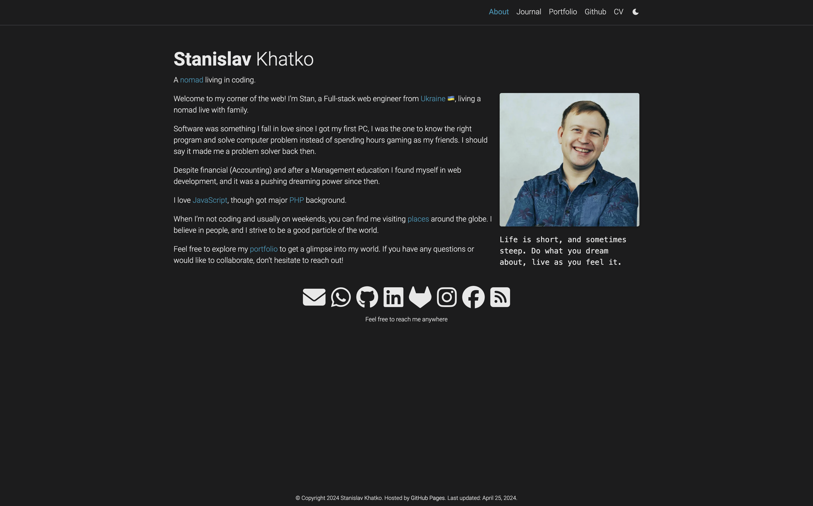

# stanhatk.github.io

<p align="center">
  <a href="https://stanhatk.github.io/">
    
  </a>
</p>

Personal portfolio and blog — [stanhatk.github.io](https://stanhatk.github.io/)

Built with [Jekyll](https://jekyllrb.com/) and hosted on [GitHub Pages](https://pages.github.com/). Forked from [al-folio](https://alshedivat.github.io/al-folio/).

## Features

- Blog with categories, tags, and pagination
- CV / resume page (JSON Resume format)
- Publications with BibTeX and Google Scholar badges
- Project portfolio
- Dark mode, responsive design, image zoom
- Giscus comments on posts

## Local development

Requires [Docker](https://www.docker.com/get-started).

```bash
# Clone
git clone https://github.com/stanhatk/stanhatk.github.io.git
cd stanhatk.github.io

# Start dev server (full image)
docker compose pull
docker compose up

# Or use the slim image
docker compose -f docker-compose-slim.yml up
```

Site runs at `http://localhost:8080` with live reload.

## Formatting

```bash
# Install (first time)
pnpm install

# Check
npx prettier . --check

# Fix
npx prettier . --write
```

## Customization

1. Edit `_config.yml` — site title, social links, analytics, features
2. Edit `_pages/about.md` — homepage content
3. Edit `_data/cv.yml` — CV entries
4. Add posts in `_posts/` (filename: `YYYY-MM-DD-title.md`)
5. Add projects in `_projects/`

See [CUSTOMIZE.md](CUSTOMIZE.md) for detailed instructions.

## License

MIT
